# Credit Risk Default — End-to-End Pipeline


A multi-table data pipeline I built to learn what a real production-style data engineering project looks like, end to end. Ingests 8 raw tables from the [Home Credit Default Risk](https://www.kaggle.com/c/home-credit-default-risk) Kaggle dataset, aggregates them into a customer-level feature store in Postgres, and trains four models to score default risk.

It's a learning project, but I tried to do everything the way I think it'd be done at a real company — separate modules per stage, Airflow DAG to orchestrate, data quality checks, tests, Docker, CI on every push. The point wasn't to win the Kaggle competition. The point was to build the whole thing properly.

## What it does

The dataset is 8 separate CSVs (~46M rows total) representing different upstream systems at a bank — application form, external credit bureau, internal previous applications, point-of-sale loans, credit card balances, and installment payments. Each one has a different grain (per-customer, per-credit, per-month, per-payment), so most of the work isn't the model — it's getting the data into a shape one customer = one row.

The pipeline:

1. Validates that all 8 source files exist with plausible row counts (fails fast on bad input)
2. Aggregates the 5 secondary tables to one row per customer
3. Left-joins them onto the application table (more on why LEFT below)
4. Engineers ratio features, cross-table interaction features, and segmentation labels
5. Encodes categoricals, imputes missings, caps outliers on money columns
6. Trains Logistic Regression, Random Forest, XGBoost, and LightGBM
7. Picks a decision threshold using F-beta with β=2.5 (explained below)
8. Exports a slim CSV for the SQL layer and a full enriched CSV

## Results

| Model | AUC-ROC | Recall (default) | Precision | F1 |
|---|---:|---:|---:|---:|
| Logistic Regression | 0.7721 | 0.696 | 0.135 | 0.226 |
| Random Forest | 0.7526 | 0.490 | 0.156 | 0.237 |
| **XGBoost** (best) | **0.7837** | **0.679** | **0.176** | **0.279** |
| LightGBM | 0.7820 | 0.648 | 0.184 | 0.286 |

XGBoost just edged out LightGBM. Sort customers by predicted risk score and the top 20% captures 56.7% of all actual defaults — 2.8× better than random screening. The chosen decision threshold is 0.45 (more on threshold reasoning below).

5-fold cross-validation AUC was 0.7571 ± 0.0139, so the model isn't overfitting.

## Tech stack

Python 3.10+, pandas, scikit-learn, XGBoost, LightGBM. PostgreSQL 14 for the feature store. Apache Airflow 2.7 for orchestration. pytest for unit tests, plus PL/pgSQL data-quality checks that run after every pipeline load. Docker Compose to spin up Postgres + the pipeline container together. GitHub Actions for CI.

## Architecture

```mermaid
flowchart LR
    subgraph SRC["8 raw CSVs"]
        A1[application_train/test]
        A2[bureau + bureau_balance]
        A3[previous_application]
        A4[POS_CASH_balance]
        A5[credit_card_balance]
        A6[installments_payments]
    end

    subgraph AGG["aggregate to one row per customer"]
        AG1[bureau<br/>two-level groupby]
        AG2[previous]
        AG3[POS cash]
        AG4[credit card]
        AG5[installments]
    end

    subgraph FEAT["feature engineering"]
        F1[domain ratios]
        F2[cross-table interactions]
        F3[behavioural flags]
    end

    subgraph WAREHOUSE["postgres feature store"]
        T[(application table<br/>+ 8 indexes)]
        V1[/vw_risk_summary view/]
        FN[/get_risk_profile fn/]
    end

    subgraph SERVE["model + outputs"]
        M[XGBoost / LightGBM]
        S[threshold sweep<br/>F-beta β=2.5]
        E[risk-scored CSV<br/>+ mlflow logs]
    end

    SRC --> AGG --> FEAT --> WAREHOUSE --> SERVE
```



Airflow runs each stage as its own task, with parallel fan-out for the 5 aggregations and a SQL data-quality check at the end that halts the DAG if any of the 8 checks fails. DAG is in `dags/credit_risk_dag.py`.

## Things that surprised me along the way

Three things didn't go the way I expected, and they're the parts of the project I think about most.

**Income-to-credit ratio is basically useless.** I assumed this would be the strongest predictor of default — it's the first thing anyone reaches for when they think about credit risk. Actual Pearson correlation with TARGET: **0.0018**. Seventeenth out of nineteen features. Age (DAYS_BIRTH) is forty-four times stronger. I'd already built my whole SQL segmentation layer around income_credit_ratio. I rebuilt it around age and employment stability after this finding. Lesson: let the data drive the analysis, not your assumptions.

**INNER JOIN dropped my best customers.** My first version of the merge step used INNER JOIN on every secondary table. The problem: a first-time borrower has no external bureau history, no prior Home Credit applications, no POS / credit card / installment records. INNER JOIN dropped them entirely — about 37,000 customers, 12% of the dataset. **Recall fell from 0.69 to 0.61** because the model couldn't see the very population it most needed to predict. Switched to LEFT JOIN and median imputation. The lost recall came back immediately.

**F1 is wrong for credit decisions.** The default threshold-picking metric in most tutorials is F1, which weighs precision and recall equally. That's wrong for a bank. A missed default (false negative) costs you the entire loan principal — maybe $10,000. A false alarm (false positive) costs you one customer's interest margin — maybe $1,200. The cost ratio is roughly 8 to 1. F1 treats them as equal. I used F-beta with β=2.5 instead, which weighs recall about 6× more than precision. The chosen threshold ends up more aggressive about flagging risk, which is what you actually want.

## Project structure

The code wasn't always laid out like this. I started with a single 924-line `pipeline.py` and refactored it into modules in two batches, verifying byte-identical output after each batch with SHA-256 checksums.

## How to run it

You need Python 3.10+, Postgres 14+ (or Docker), and ~3GB free disk space for the raw data.

```bash
# Clone and install
git clone https://github.com/NADEEMTHEBA8/credit-risk-analysis.git
cd credit-risk-analysis
make setup

# Download the 8 CSVs from Kaggle and put them in data/raw/
# https://www.kaggle.com/c/home-credit-default-risk/data

# Run the full pipeline (~6 minutes on an M-series Mac)
make run

# Or use Docker, which brings up Postgres too
make docker-up
```

Outputs land in `data/processed/` (two CSVs) and `figures/` (9 PNGs). To load the slim CSV into Postgres and run the SQL analysis:

```bash
make sql-load
make sql-run
```

To run the Airflow DAG locally:

```bash
make airflow-up
# UI at http://localhost:8080 — login airflow/airflow
```

## What I'd do next if I had more time

Three things I think about most:

- Replace the pandas aggregations with Spark for the `bureau_balance` step. 27 million rows is enough that the next dataset size up would OOM.
- Move the SQL transformations into dbt. The `UPDATE` block that fills in the segmentation columns is fine but it's imperative; dbt models would be versioned and testable.
- Serve the scoring model as a FastAPI endpoint, so the project has a real serving layer instead of just batch CSV exports.

## Acknowledgements

Dataset: [Home Credit Default Risk](https://www.kaggle.com/c/home-credit-default-risk) (Kaggle, 2018) — used under competition terms for educational purposes.

The data is real and the dataset is famous, but the pipeline structure, refactor, orchestration, tests, and documentation are my own work. Built as a portfolio project while learning data engineering.

## Author

**Nadeem Theba** — Rajkot, India
[GitHub](https://github.com/NADEEMTHEBA8) · [LinkedIn](https://linkedin.com/in/nadeem-theba-602862208)