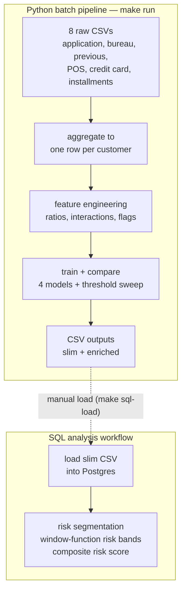

# Credit Risk Default — Multi-Table Analytics Pipeline


A practical credit-risk analytics engineering project built around multi-table ETL,
customer-level aggregation, and SQL-based risk analysis. It takes the 8 raw tables
from the [Home Credit Default Risk](https://www.kaggle.com/c/home-credit-default-risk)
Kaggle dataset, aggregates them into one row per customer, trains four models to
score default risk, and exports a clean dataset for a separate SQL risk-analysis layer.

This is a portfolio project. The dataset is real and widely used; the aggregation
logic, feature engineering, threshold work, SQL analysis, and tests are my own. The
focus was on the part of the work that actually takes the time — turning eight tables
at four different grains into a defensible customer-level dataset — not on maximizing
leaderboard performance.

---

## What it does

The dataset is 8 separate CSVs (~46M rows total) representing different systems at a
bank — the application form, external credit bureau records, internal previous
applications, point-of-sale loans, credit card balances, and installment payments.
Each table has a different grain (per-customer, per-credit, per-month, per-payment),
so most of the work is reshaping the data into one customer = one row.

The pipeline runs as a single-machine batch job:

1. Validates that all 8 source files exist with plausible row counts
2. Aggregates the 5 secondary tables to one row per customer
3. Left-joins them onto the application table
4. Engineers ratio features, cross-table interaction features, and segmentation labels
5. Encodes categoricals, imputes missing values, and caps outliers
6. Trains Logistic Regression, Random Forest, XGBoost, and LightGBM
7. Selects a decision threshold using F-beta with β=2.5
8. Exports a slim CSV for SQL analysis and a full enriched CSV

---

## Results

| Model | AUC-ROC | Recall (default) | Precision | F1 |
|---|---:|---:|---:|---:|
| Logistic Regression | 0.7721 | 0.6963 | 0.1739 | 0.2783 |
| Random Forest | 0.7526 | 0.4898 | 0.2095 | 0.2935 |
| **XGBoost** | **0.7837** | **0.6788** | **0.1914** | **0.2986** |
| LightGBM | 0.7820 | 0.6475 | 0.1993 | 0.3048 |

XGBoost was selected as the final model on AUC-ROC, which is threshold-independent.
LightGBM is within 0.0017 AUC and has a slightly higher F1 — the two are close, and
the threshold choice below matters more than that gap.

Sorting customers by predicted risk score, the top 20% by score captures 56.7% of
all actual defaults — about 2.8× better than screening a random 20%.

The selected decision threshold is 0.45 using F-beta with β=2.5 to prioritize recall
over precision for credit-risk screening.

5-fold cross-validation AUC was 0.7571 ± 0.0139 on a 50k-row subsample.

---

## Tech stack

- Python 3.10+
- pandas
- scikit-learn
- XGBoost
- LightGBM
- PostgreSQL 14
- pytest
- Docker Compose
- GitHub Actions

---

## Architecture

The project has two independent parts:

1. A Python batch pipeline that produces CSV outputs
2. A separate SQL analysis workflow run against those outputs

The handoff between them is a CSV export.



---

## Things I learned along the way

### INNER JOIN silently dropped first-time borrowers

My first merge used INNER JOIN on every secondary table. A first-time borrower has
no bureau history, no prior applications, and no POS/credit-card/installment records,
so INNER JOIN dropped them entirely — roughly 37,000 customers.

Recall dropped from 0.69 to 0.61 because the model lost a population it specifically
needed to see. Switching to LEFT JOIN with median imputation restored it.

### Income-to-credit ratio was weaker than expected

I assumed income-to-credit ratio would be one of the strongest predictors. Its actual
correlation with the target ended up being close to zero.

Age and employment stability were much stronger signals, which changed how I built
the SQL segmentation logic.

### F1 was the wrong threshold metric

F1 weights precision and recall equally. For lending they are not equal: missing a
default is typically much more expensive than incorrectly flagging a low-risk customer.

I selected the threshold using F-beta (β=2.5) to weight recall more heavily and bias
the system toward catching risky borrowers more aggressively.

---

## How to run it

You need:
- Python 3.10+
- PostgreSQL 14+ (or Docker)
- ~3GB free disk for the raw data

```bash
# Clone repository
git clone https://github.com/NADEEMTHEBA8/credit-risk-analysis.git
cd credit-risk-analysis

# Setup environment
make setup

# Download Kaggle CSVs into data/raw/

# Run full pipeline
make run
```

Outputs are written to `data/processed/` (two CSVs) and `figures/` (4 PNG charts).

---

## SQL analysis workflow

The SQL analysis is a separate analyst workflow.

```bash
# Start local Postgres
make docker-up

# Load processed CSV into Postgres
make sql-load

# Run SQL analysis
make sql-run
```

The SQL layer includes:
- risk segmentation
- percentile risk bands
- window-function analysis
- composite scoring logic

If Postgres rejects the connection with a password error, the local database volume
is stale — reset it with `docker compose down -v`, then `make docker-up` again.

---

## What I'd explore next

- Move SQL transformations into versioned transformation models
- Add a lightweight scoring interface for per-customer predictions
- Tune β using real business cost data instead of estimated ratios

---

## Acknowledgements

Dataset:
[Home Credit Default Risk](https://www.kaggle.com/c/home-credit-default-risk)
(Kaggle, 2018), used under competition terms for educational purposes.

Built as a portfolio project while learning analytics engineering.

---

## Author

**Nadeem Theba** — Rajkot, India

- GitHub: https://github.com/NADEEMTHEBA8
