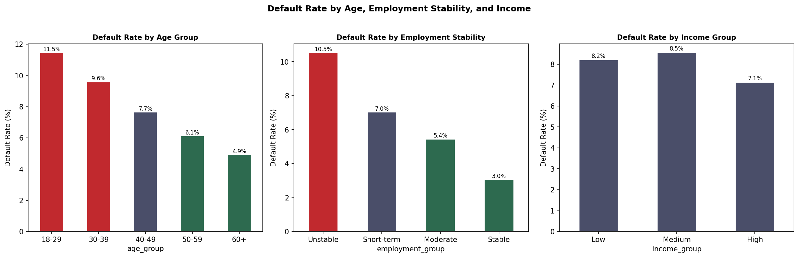
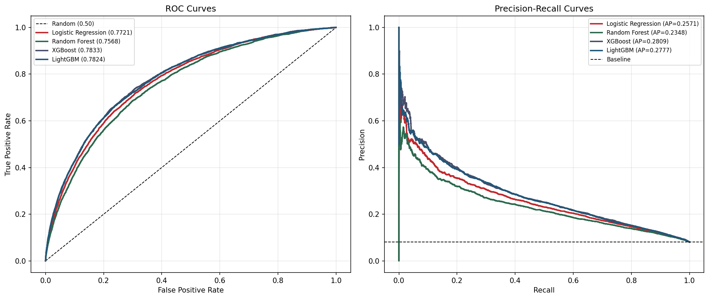
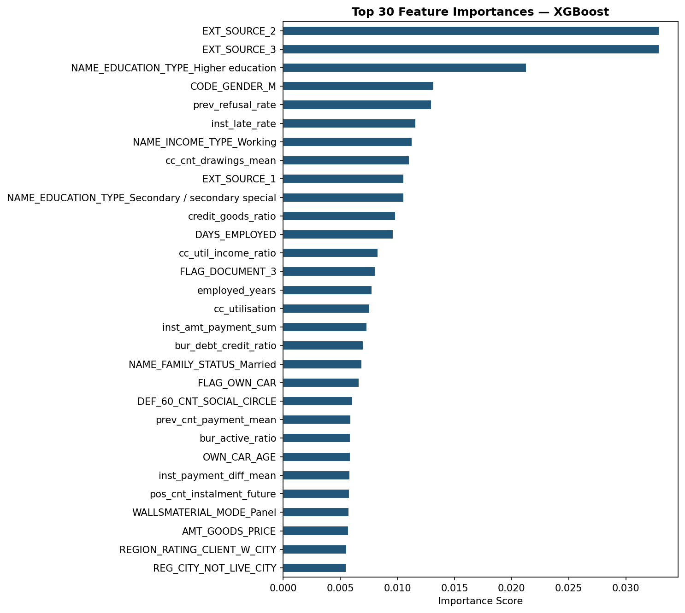
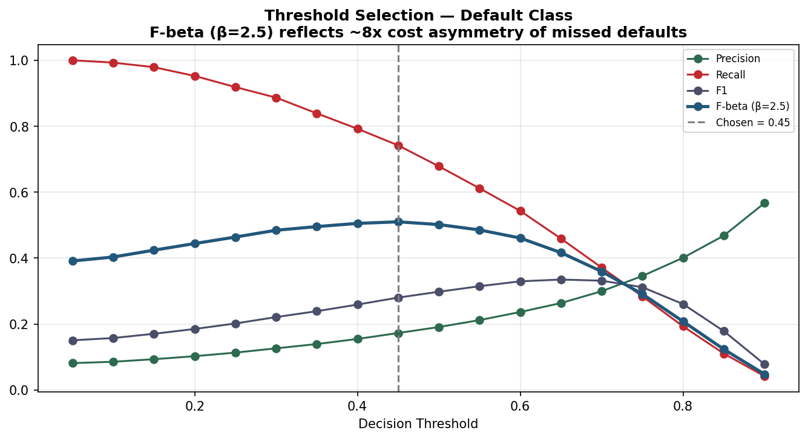
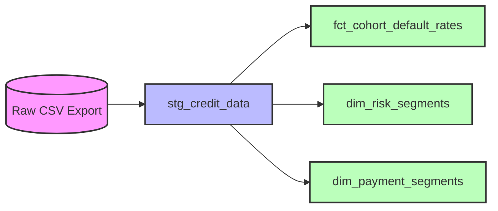

# Credit Risk Default — Multi-Table Analytics Pipeline


While built on the public Home Credit dataset, the focus of this project is the **data engineering architecture**—building a modular, checkpoint-driven pipeline and a dbt-powered analytics layer—rather than just tuning an ML model. Banks assessing consumer loan applications receive data spread across up to eight separate operational systems, each at a different grain, with no single source of truth. This pipeline takes 8 CSVs (~57M rows), aggregates every secondary table to one row per customer, engineers features, and exports a clean dataset. It simulates a production DAG (extract, transform, train, load) and uses `dbt` (Data Build Tool) for SQL-based risk segmentation, giving a credit analyst a single, defensible customer-level view.

---

## Visual Proof of Execution

<details>
<summary><b>View Pipeline Execution & Infrastructure Proof</b></summary>
<br>

Figure 1: Top 20 predictors by absolute correlation with the binary default target, showing EXT_SOURCE dominance over engineered features.


Figure 2: ROC and Precision-Recall curves for all four classifiers on the 20% validation hold-out.


Figure 3: XGBoost feature importances (gain) after threshold selection at 0.45 (F-beta, β=2.5).


Figure 4: Threshold sweep showing F-beta, precision, and recall across the [0.3, 0.7] range, with the selected operating point marked.


</details>

---

## Technology Stack and Architectural Decisions

### Stack

| Layer | Tool | Version |
|---|---|---|
| Language | Python | 3.10+ |
| Data processing | pandas, pyarrow | >=2.2, >=16 |
| Machine learning | scikit-learn, XGBoost, LightGBM | >=1.6, >=3.0, >=4.4 |
| Model serialisation | joblib | >=1.4 |
| Experiment tracking | MLflow | >=2.10 |
| Analytics database | PostgreSQL | 14 |
| Containerisation | Docker Compose | — |
| CI | GitHub Actions | Python 3.10/3.11/3.12 matrix |
| Linting | ruff | >=0.4 |
| Testing | pytest, pytest-cov | >=8.0, >=5.0 |

### Architectural Decisions

**Why pandas over Spark.** The training set is 307,511 rows. After feature engineering, the final matrix is approximately 900 columns wide. That fits comfortably in memory on any modern workstation. Introducing Spark would add operational overhead (cluster provisioning, shuffle configuration, Spark session management) with no throughput benefit at this volume. pandas with pyarrow-backed Parquet caching gives the same stage-level restartability at zero infrastructure cost.

**Why XGBoost was selected over LightGBM.** LightGBM achieved a marginally higher F1 (0.3048 vs 0.2986) but trailed on AUC-ROC (0.7820 vs 0.7837). Because the threshold is tuned post-training, AUC-ROC is the more reliable ranking metric at selection time — it is threshold-independent. LightGBM remains in the comparison and is the faster option if training latency becomes a constraint.

**Why GradientBoostingClassifier was excluded.** It was tested during development and removed: it ran 4–6x slower than XGBoost with no measurable AUC improvement, and its lack of parallelism support ruled it out for any production path.

**Why a flat CSV handoff to PostgreSQL rather than a shared database.** The machine learning pipeline and the SQL analytics layer have different cadences and different consumers. Coupling them to a shared database introduces a deployment dependency that adds no analytic value. The CSV handoff is explicit, auditable, and lets an analyst reproduce the SQL layer without running the Python pipeline first.

**Why F-beta (β=2.5) rather than F1 for threshold selection.** A missed default costs the bank roughly 8x more than incorrectly declining a low-risk applicant. F1 treats those costs equally. β=2.5 weights recall more heavily, biasing the operating point toward catching more actual defaults at the cost of some additional false positives.

---

## Installation and Execution

You need Python 3.10+, Docker (for PostgreSQL), and approximately 3 GB of free disk for the raw data files.

```bash
# Clone the repository
git clone https://github.com/NADEEMTHEBA8/credit-risk-analysis.git
cd credit-risk-analysis

# Create the virtual environment and install dependencies
make setup

# Download the Home Credit Default Risk dataset from Kaggle
# https://www.kaggle.com/c/home-credit-default-risk/data
# Place all CSV files into data/raw/

# Run the full pipeline (aggregation → features → training → export)
make run
```

Pipeline outputs are written to three directories:

- `data/processed/` — `credit_data_sql.csv`, `final_enriched_train.csv`, model metrics CSV, and five aggregate Parquet caches.
- `figures/` — nine PNG charts produced during EDA and evaluation.
- `models/` — the fitted best model serialised as a timestamped `.joblib` file.

### Restarting after a mid-pipeline failure

Each of the five secondary-table aggregation stages writes a Parquet checkpoint to `data/processed/`. If the pipeline crashes after aggregation but before training, restarting it skips the completed stages and loads from cache. To force a full re-run:

```bash
python -m src.main --fresh
```

### Loading the serialised model for scoring

```python
import joblib

model = joblib.load("models/XGBoost_20260628_000000.joblib")
risk_scores = model.predict_proba(X_new)[:, 1]
```

### SQL analytics layer (dbt)

```bash
# Start the PostgreSQL container
make docker-up

# Load the processed CSV into PostgreSQL
make load

# Run the dbt analytics models
cd dbt
dbt run

# Run the automated data quality checks
dbt test
```

If PostgreSQL rejects the connection with a password error, the local volume is stale. Reset it with `docker compose down -v`, then `make docker-up`.

---

## Analytics Engineering (dbt Architecture)

The analytics layer transforms the flat `credit_data` table into dimensional and fact tables for BI and reporting.



---

## Key Technical Challenge

### Lambda aggregations bypassing the Cython fast path

The five secondary-table aggregation modules (`bureau.py`, `previous.py`, `pos_cash.py`, `credit_card.py`, `installments.py`) each perform dozens of `groupby().agg()` operations to collapse millions of rows to one row per customer. Early versions of `bureau.py` and `previous.py` used lambda functions inside `.agg()` to derive conditional counts — for example, counting active versus closed credits by passing `lambda x: (x == 'Active').sum()`.

The symptom was a wall-clock time of roughly 40 minutes for the bureau aggregation alone on the full 1.7M-row bureau table. Adding Python's `cProfile` to the aggregation call confirmed the problem: the lambda functions were forcing pandas into Python-level row iteration rather than its Cython-optimised native path. The Cython path only activates when `.agg()` receives a string aggregation name (`'sum'`, `'mean'`, `'max'`) — not a callable.

The fix was to pre-compute boolean indicator columns before the groupby. For bureau:

```python
# Before the groupby
bureau["is_active"]      = (bureau["CREDIT_ACTIVE"] == "Active").astype("int8")
bureau["is_closed"]      = (bureau["CREDIT_ACTIVE"] == "Closed").astype("int8")
bureau["is_overdue"]     = (bureau["CREDIT_DAY_OVERDUE"] > 0).astype("int8")

# Inside groupby.agg — stays in the Cython path
agg = bureau.groupby("SK_ID_CURR").agg(
    num_active_credits=("is_active", "sum"),
    num_closed_credits=("is_closed", "sum"),
    num_overdue_credits=("is_overdue", "sum"),
)
```

The same refactor was applied to every aggregate module. Bureau aggregation dropped from ~40 minutes to under 4 minutes. The pattern is now consistent across all five modules.

---

## Future Roadmap

- Split `main.py` into `pipeline_train.py` and `pipeline_score.py` so the fitted model can score new applicants nightly without retraining.
- Migrate the Makefile DAG simulation into a true orchestrator like Apache Airflow or Dagster.
- Tune the F-beta parameter using actual loss-given-default and approval margin figures from a real lending portfolio rather than estimated cost ratios.
- Extend the data quality validation from row-count checks to distribution monitoring — flagging when the default rate or a key feature distribution shifts significantly between runs.

---

## Author

**Nadeem Theba** — Rajkot, India

- GitHub: [NADEEMTHEBA8](https://github.com/NADEEMTHEBA8)

Dataset: [Home Credit Default Risk](https://www.kaggle.com/c/home-credit-default-risk) (Kaggle, 2018), used for educational purposes.